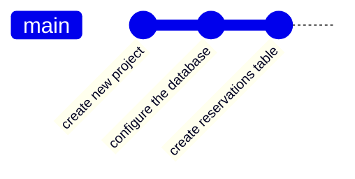
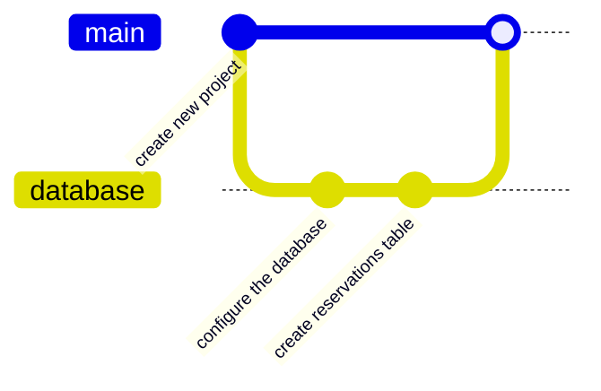
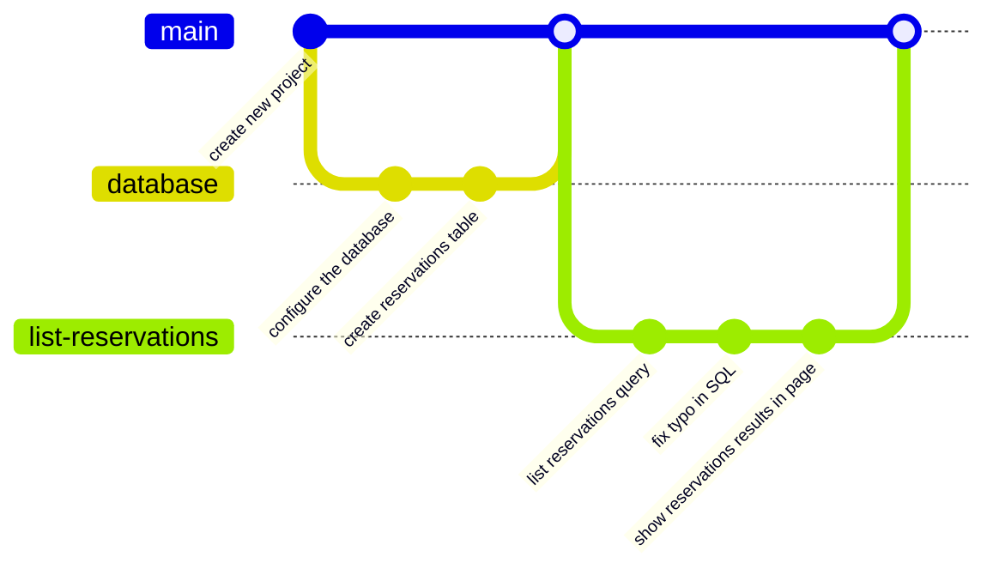
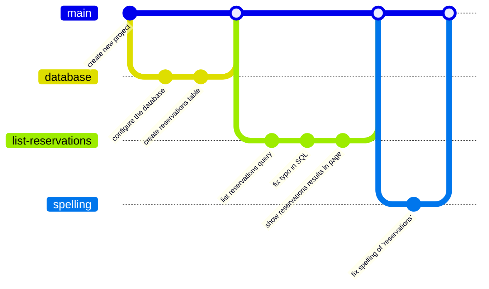

# main

```mermaid
%%{init: { 'gitGraph': {'showCommitLabel': true }} }%%
    gitGraph
       commit id: "create new project"
       commit id: "configure the database"
       commit id: "create reservations table"
```

# Branching and merging

Branch, pull request, merge

```mermaid
%%{init: { 'gitGraph': {'showCommitLabel': true }} }%%
    gitGraph
       commit id: "create new project"
       branch database
       commit id: "configure the database"
       commit id: "create reservations table"
       checkout main
       merge database
```

repeat:

```mermaid
%%{init: { 'gitGraph': {'showCommitLabel': true }} }%%
    gitGraph
       commit id: "create new project"
       branch database
       commit id: "configure the database"
       commit id: "create reservations table"
       checkout main
       merge database
       branch list-reservations
       commit id: "list reservations query"
       commit id: "fix typo in SQL"
       commit id: "show reservations results in page"
       checkout main
       merge list-reservations
```

and again:

```mermaid
%%{init: { 'gitGraph': {'showCommitLabel': true }} }%%
    gitGraph
       commit id: "create new project"
       branch database
       commit id: "configure the database"
       commit id: "create reservations table"
       checkout main
       merge database
       branch list-reservations
       commit id: "list reservations query"
       commit id: "fix typo in SQL"
       commit id: "show reservations results in page"
       checkout main
       merge list-reservations
       branch spelling
       commit id: "fix spelling of 'reservations'"
       checkout main
       merge spelling
```

Isn't this great?!

